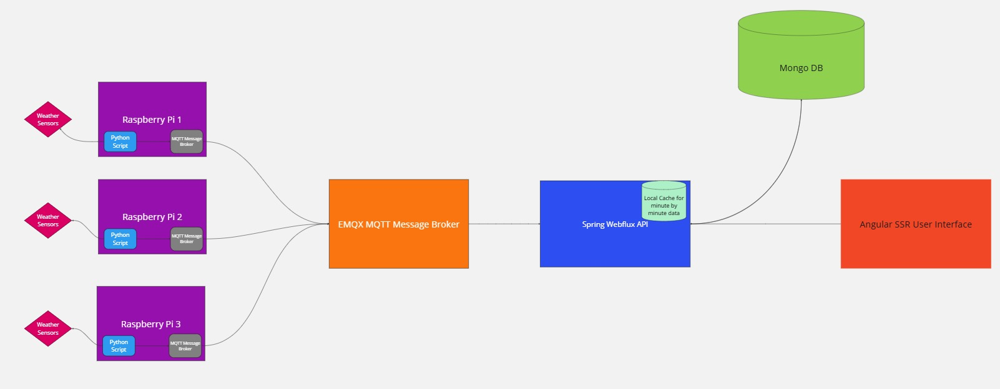

# 🌩️ Nimbus — Real-Time Weather Station Platform

> A full-stack weather monitoring system that streams data from a physical Raspberry Pi sensor to a cloud-hosted application using MQTT, Spring WebFlux, MongoDB, and Angular SSR.

---

## 🛰️ Overview

Nimbus collects minute-by-minute atmospheric data from a custom-built weather station (running on a Raspberry Pi), ingests the data over MQTT into a reactive Java backend, stores it in MongoDB, and renders it in real-time via an Angular SSR frontend deployed on a virtual machine with NGINX.



---

## ⚙️ Tech Stack

| Layer        | Technology                             |
|--------------|-----------------------------------------|
| IoT Sensor   | Raspberry Pi, Python, BME280            |
| Messaging    | MQTT (Mosquitto broker)                 |
| Backend      | Java, Spring WebFlux, Reactor, MongoDB  |
| Frontend     | Angular (SSR with hydration), ngx-charts |
| Deployment   | Ubuntu VM, NGINX, PM2                   |

---

## 🌐 Live Demo

🔗 [https://nimbus-weather-project.com](https://nimbus-weather-project.com)

---

## 🔧 Features

- 📡 **Real-time streaming** from Raspberry Pi over MQTT
- 🧠 **Reactive backend** using Spring WebFlux and Reactor
- 🗄️ **Minute-by-minute ingestion** into MongoDB
- 📊 **Historical charting** by metric and time
- 🔄 **SSR-enabled Angular UI** for SEO & fast load
- ☁️ **Self-hosted on a virtual machine** using NGINX

---

## 🧪 Local Dev Setup

```bash
# clone repo
git clone https://github.com/ajcuddeback/nimbus.git
cd nimbus

# Setup backend
cd weatherapi/weatherapi
./mvnw spring-boot:run

# Setup frontend
cd ../../app
npm install
npm run dev:ssr