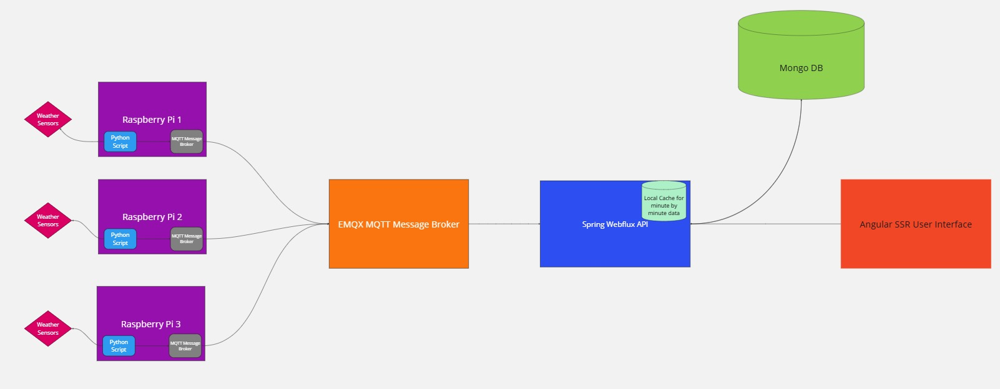

# 🌩️ Nimbus — Real-Time Weather Station Platform

> A full-stack weather monitoring system that streams data from a physical Raspberry Pi sensor to a cloud-hosted application using MQTT, Spring WebFlux, MongoDB, and Angular SSR.

---

## 🛰️ Overview

Nimbus collects minute-by-minute atmospheric data from a custom-built weather station (running on a Raspberry Pi), ingests the data over MQTT into a reactive Java backend, stores it in MongoDB, and renders it in real-time via an Angular SSR frontend deployed on a virtual machine with NGINX.



---

## ⚙️ Tech Stack

| Layer        | Technology                             |
|--------------|-----------------------------------------|
| IoT Sensor   | Raspberry Pi, Python, BME280            |
| Messaging    | MQTT (Mosquitto broker)                 |
| Backend      | Java, Spring WebFlux, Reactor, MongoDB  |
| Frontend     | Angular (SSR with hydration), ngx-charts |
| Deployment   | Ubuntu VM, Docker, NGINX, Certbot       |

---

## 🌐 Live Demo

🔗 [https://nimbus-weather-project.com](https://nimbus-weather-project.com)

---

## 🔧 Features

- **Real-time streaming** from Raspberry Pi over MQTT
- **Reactive backend** using Spring WebFlux and Reactor
- **Minute-by-minute ingestion** into MongoDB
- **Historical charting** by metric and time
- **SSR-enabled Angular UI** for SEO & fast load
- **Self-hosted on a virtual machine** using NGINX

---

## 🧪 Local Dev Setup

### Note
You must have a raspberry pi running the code from https://github.com/ajcuddeback/nimbus-pi.git and a MongoDB instance

```bash
# clone repo
git clone https://github.com/ajcuddeback/nimbus.git
cd nimbus

# Setup backend
cd weatherapi/weatherapi
./mvnw spring-boot:run

# Setup frontend
cd ../../app
npm install
npm run dev:ssr

---

## 🚀 Deployment

### Prerequisites

- Ubuntu VPS with Docker and Docker Compose installed
- `/etc/nimbus.env` on the server with the required environment variables

### Environment File

Create `/etc/nimbus.env` on the server:

```env
MONGODB_URI=mongodb+srv://...
MQTT_HOST=...
MQTT_PORT=...
MQTT_USERNAME=...
MQTT_PASSWORD=...
WEATHER_API_KEY=...
```

### Steps

1. Install Docker:
   ```bash
   sudo apt update
   sudo apt install -y ca-certificates curl gnupg
   sudo install -m 0755 -d /etc/apt/keyrings
   curl -fsSL https://download.docker.com/linux/ubuntu/gpg | sudo gpg --dearmor -o /etc/apt/keyrings/docker.gpg
   sudo chmod a+r /etc/apt/keyrings/docker.gpg
   echo "deb [arch=$(dpkg --print-architecture) signed-by=/etc/apt/keyrings/docker.gpg] https://download.docker.com/linux/ubuntu $(. /etc/os-release && echo "$VERSION_CODENAME") stable" | sudo tee /etc/apt/sources.list.d/docker.list > /dev/null
   sudo apt update
   sudo apt install -y docker-ce docker-ce-cli containerd.io docker-buildx-plugin docker-compose-plugin
   ```

2. Allow your user to run Docker without `sudo`:
   ```bash
   sudo usermod -aG docker $USER
   newgrp docker
   ```

3. Clone the repo and start the app:
   ```bash
   git clone https://github.com/ajcuddeback/nimbus.git
   cd nimbus
   docker compose up -d --build
   ```

4. Install nginx:
   ```bash
   sudo apt install nginx
   ```

5. Copy the nginx config:
   ```bash
   sudo cp nginx/nginx.conf /etc/nginx/sites-available/nimbus
   ```

6. Install certbot:
   ```bash
   sudo apt install certbot python3-certbot-nginx
   ```

7. Buy a domain and add DNS A records pointing to your VPS IP — you'll need both `@` and `www` records.

8. Issue the SSL certificate (certbot will auto-update the nginx config):
   ```bash
   sudo certbot --nginx -d nimbus-weather-project.com -d www.nimbus-weather-project.com
   ```

9. Set permissions:
   ```bash
   sudo chmod 755 /home/ubuntu
   ```

10. Enable and configure nginx:
    ```bash
    sudo systemctl enable nginx
    sudo ln -s /etc/nginx/sites-available/nimbus /etc/nginx/sites-enabled/
    sudo rm /etc/nginx/sites-enabled/default
    ```

11. Test and reload:
    ```bash
    sudo nginx -t
    sudo systemctl reload nginx
    sudo systemctl restart nginx
    ```

### Redeploying

```bash
git pull
docker compose up -d --build
```

---

## 🛠️ Useful Commands

### Docker

```bash
# View running containers
docker compose ps

# View logs for a service (backend or frontend)
docker compose logs -f backend
docker compose logs -f frontend

# Restart a single service
docker compose restart backend
docker compose restart frontend

# Stop all services
docker compose down

# Rebuild and restart a single service
docker compose up -d --build backend
docker compose up -d --build frontend
```

### nginx

```bash
# Test config for syntax errors
sudo nginx -t

# Reload config without downtime
sudo systemctl reload nginx

# View nginx error logs
sudo tail -f /var/log/nginx/error.log

# View nginx access logs
sudo tail -f /var/log/nginx/access.log
```

### Certbot

```bash
# Check certificate expiry
sudo certbot certificates

# Manually trigger renewal
sudo certbot renew

# Test renewal without actually renewing
sudo certbot renew --dry-run
```